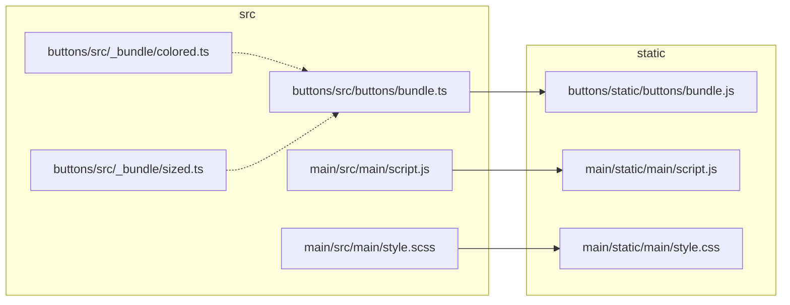

# Django + esbuild project example

The most notable part of this repository is the [build.mjs](build.mjs) script, which builds scripts and styles from `*/src/` into `*/static/`. Paths that contain parts prefixed with an underscore (e.g., `_bundle/` and `_module.js`) are ignored but can be used in imports. This script can be used in watch mode with the argument `--watch` (see scripts in `package.json`).

In this example there are two applications:
* `main` defines the basic layout;
* `buttons` serve form with bundled scripts.

These applications are being built like this:

